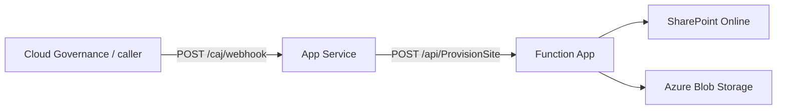

# Azure SharePoint Provisioning Integration

This solution provisions SharePoint sites using a two-tier Azure architecture:

1. **App Service** — public webhook endpoint for Cloud Governance (or other callers)
2. **Function App** — PowerShell worker that connects to SharePoint Online and runs provisioning steps



---

## Azure resources

| Resource | Example name | Purpose |
|----------|--------------|---------|
| Resource group | `SPO-Automation` | Contains all components |
| App Service | `app-intra-poc-linux1` | Webhook proxy (.NET 8) |
| Function App | `func-secure-processor02` | PowerShell 7.4 provisioning worker |
| Storage account | `spostoragecaj134` | Templates, branding assets, function storage |

Infrastructure for the Function App (managed identity + blob RBAC) is created with `CreateInfra.ps1`.

---

## Request flow

### 1. External caller → App Service

**Endpoint:** `POST https://<app-service>/caj/webhook`

**Required header:**

| Header | App setting | Description |
|--------|-------------|-------------|
| `X-Cloud-Governance-Token` | `CLOUD_GOVERNANCE_TOKEN` | Shared secret from Cloud Governance |

**Request body (JSON):**

```json
{
  "objectUrl": "https://<tenant>.sharepoint.com/sites/<site-name>",
  "action": "ProvisionDocumentLibraries",
  "projectName": "My Project"
}
```

Only `objectUrl` is required by the Function App. The Function validates that `objectUrl` is a SharePoint site URL.

**Example (PowerShell):**

```powershell
$body = @{
    objectUrl   = "https://contoso.sharepoint.com/sites/MySite"
    action      = "ProvisionDocumentLibraries"
    projectName = "Test"
} | ConvertTo-Json

Invoke-RestMethod `
    -Uri "https://app-intra-poc-linux1.azurewebsites.net/caj/webhook" `
    -Method Post `
    -Headers @{ "X-Cloud-Governance-Token" = "<your-token>" } `
    -Body $body `
    -ContentType "application/json"
```

> **Note:** The legacy header `X-API-KEY` is no longer used. The App Service falls back to `CAJ_API_KEY` only if `CLOUD_GOVERNANCE_TOKEN` is not set.

### 2. App Service → Function App

After validating the governance token, the App Service forwards the same JSON body to the Function App.

| Header | App setting | Where set |
|--------|-------------|-----------|
| `X-INTERNAL-KEY` | `FUNCTION_HEADER_VALUE` | App Service **and** Function App (must match) |
| `x-functions-key` | `FUNCTION_KEY` | App Service only |

The function host key is sent in the **`x-functions-key`** header, not in the URL query string.

---

## App Service configuration

Configure under **Configuration → Application settings** for `app-intra-poc-linux1`.

| Setting | Required | Description |
|---------|----------|-------------|
| `CLOUD_GOVERNANCE_TOKEN` | Yes | Expected value of `X-Cloud-Governance-Token` from callers |
| `FUNCTION_URL` | Yes | Function endpoint without `?code=`, e.g. `https://func-secure-processor02.azurewebsites.net/api/ProvisionSite` |
| `FUNCTION_KEY` | Yes | Function host key (from Function App → Functions → ProvisionSite → Function keys) |
| `FUNCTION_HEADER_VALUE` | Yes | Internal secret sent as `X-INTERNAL-KEY` — **must differ from `CLOUD_GOVERNANCE_TOKEN`** |
| `CAJ_API_KEY` | No | Legacy fallback if `CLOUD_GOVERNANCE_TOKEN` is not set; remove once migrated |

### App Service behaviour

- Rejects requests without a valid `X-Cloud-Governance-Token` (401)
- Validates JSON body before forwarding
- Uses timing-safe comparison for token checks
- Forwards request to the Function App with internal headers

### Deploy App Service

From `AppService/app-intra-poc-linux1`:

```powershell
dotnet publish -c Release -o ./publish
Compress-Archive -Path ./publish/* -DestinationPath ./deploy.zip -Force

az webapp deployment source config-zip `
    --resource-group SPO-Automation `
    --name app-intra-poc-linux1 `
    --src "./deploy.zip"
```

Source: `AppService/app-intra-poc-linux1/Program.cs`

---

## Function App configuration

Configure under **Configuration → Application settings** for `func-secure-processor02`.

### Authentication and security

| Setting | Required | Description |
|---------|----------|-------------|
| `FUNCTION_HEADER_VALUE` | Yes | Must match the App Service value; validated from `X-INTERNAL-KEY` |
| `WEBSITE_LOAD_CERTIFICATES` | Yes | `*` or comma-separated certificate thumbprints for SharePoint auth |
| `SPO_CERT_THUMBPRINT` | Yes | Thumbprint of the `.pfx` uploaded under **Certificates** (no spaces) |
| `SPO_CLIENT_ID` | Yes | Entra app registration (application) client ID |
| `SPO_TENANT_ID` | Yes | Entra tenant ID |
| `SPO_CERT_PASSWORD` | Conditional | Password for the uploaded `.pfx` (only if the cert requires it) |

**Certificate requirements:**

- Upload the **same** certificate (`.pfx`) to:
  1. Function App → **Certificates → Bring your own certificates**
  2. Entra ID → **App registrations** → your app → **Certificates & secrets**
- The thumbprint in `SPO_CERT_THUMBPRINT` must match the uploaded cert
- The cert is loaded from `/var/ssl/private/{thumbprint}.p12` on Linux (not from the deployment zip)

### SharePoint provisioning

| Setting | Required | Description |
|---------|----------|-------------|
| `PNP_TEMPLATE_BLOB_URL` | Yes | Full URL to the PnP site template XML in blob storage |
| `PNP_BRANDING_BLOB_URL` | Yes | Full URL to the branding image in blob storage |
| `PNP_CONTENT_TYPE_NAME` | No | Content type name (default: `content category page`) |
| `PNP_CONTENT_TYPE_LIST` | No | Comma-separated lists (default: `Site Pages`) |
| `PNP_VIEWS_LIST` | No | Lists to update views on (default: `Documents, Site Pages`) |
| `SPO_HUB_SITE_URL` | No | Hub site URL; if set, new sites are associated to this hub |
| `PNP_STORAGE_BLOB_SAS` | No | Optional SAS token if blobs are not accessed via managed identity |

### Storage access

The Function App uses **system-assigned managed identity** to download blobs when no SAS is present. Assign **Storage Blob Data Contributor** on the storage account to the Function App identity (see `CreateInfra.ps1`).

### HTTP trigger

| Property | Value |
|----------|-------|
| Function name | `ProvisionSite` |
| Route | `/api/ProvisionSite` |
| Auth level | `function` (requires host key via `x-functions-key`) |
| Method | `POST` |

Source: `FunctionApp/ProvisionSite/run.ps1`, `FunctionApp/Modules/Provisioning.psm1`

### Deploy Function App

Run from the **`FunctionApp`** folder:

```powershell
cd FunctionApp
..\DeployCode.ps1
```

Or manually:

```powershell
Compress-Archive `
    -Path .\host.json, .\requirements.psd1, .\Modules, .\ProvisionSite, .\ExternalModules `
    -DestinationPath .\function.zip -Force

az functionapp deployment source config-zip `
    --resource-group SPO-Automation `
    --name func-secure-processor02 `
    --src ".\function.zip"
```

Do **not** include `cert.pfx` in the zip. Use the portal certificate store instead.

---

## Provisioning steps (Function App)

When a valid request is received, the Function App runs these steps in order:

1. DownloadTemplate — fetch PnP template from blob storage
2. Set-SiteRegionalSettings
3. Set-SearchSettings
4. Install-App
5. Add-GroupstoSharePointGroups
6. Invoke-PnPSiteTemplate
7. Set-Branding
8. Add-ContentTypes
9. Add-SiteColumns
10. Set-Views
11. Add-HubSites (skipped if `SPO_HUB_SITE_URL` is not set)

---

## Setting secrets with special characters

If a secret contains `&` or other shell metacharacters (e.g. `Psalm87&6`), use a JSON settings file with Azure CLI instead of inline values:

```powershell
az webapp config appsettings set `
    --resource-group SPO-Automation `
    --name app-intra-poc-linux1 `
    --settings "@.\appservice-settings.json"
```

---

## Troubleshooting

| Symptom | Likely cause |
|---------|----------------|
| **401 Unauthorized** on webhook | Wrong or missing `X-Cloud-Governance-Token`; App Service not redeployed with latest code |
| **500 — tokens must differ** | `CLOUD_GOVERNANCE_TOKEN` and `FUNCTION_HEADER_VALUE` are the same value |
| **401 on Function App** | `FUNCTION_HEADER_VALUE` mismatch between App Service and Function App |
| **401 / invalid client (Entra)** | Certificate thumbprint on Function App does not match cert registered in Entra app |
| **401 on blob download** | Function managed identity missing **Storage Blob Data Contributor** on the storage account |
| **Certificate store error** | `SPO_CERT_THUMBPRINT` wrong, or `WEBSITE_LOAD_CERTIFICATES` not set; restart after cert upload |

---

## Project layout

```
Azure-SPIntegration/
├── AppService/app-intra-poc-linux1/   # .NET webhook (Program.cs)
├── FunctionApp/
│   ├── ProvisionSite/                 # HTTP trigger (run.ps1)
│   ├── Modules/                       # Provisioning.psm1, Telemetry.psm1
│   └── ExternalModules/               # Az.Accounts, PnP.PowerShell (bundled)
├── CreateInfra.ps1                    # Function App + managed identity + RBAC
├── DeployCode.ps1                     # Deploy Function App + test webhook call
└── CreateAppService.ps1               # App Service setup (initial)
```

---

## Security checklist

- [ ] `CLOUD_GOVERNANCE_TOKEN` and `FUNCTION_HEADER_VALUE` use **different** strong values
- [ ] Function host key is in `FUNCTION_KEY`, not in `FUNCTION_URL`
- [ ] SharePoint certificate is in the Function App certificate store **and** Entra app registration
- [ ] `cert.pfx` is **not** committed to source control or included in deployment zips
- [ ] Function App managed identity has least-privilege blob access (Storage Blob Data Contributor)
- [ ] Cloud Governance sends `X-Cloud-Governance-Token`, not `X-API-KEY`
