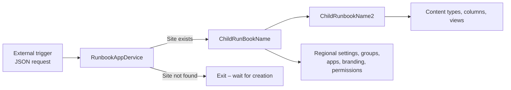

# SharePoint Site Provisioning – Azure Automation

PowerShell runbooks for automating SharePoint Online site configuration as part of the broader **Site Provisioning** solution. These scripts run in **Azure Automation** and use **PnP PowerShell** with **certificate-based app-only authentication** to connect to SharePoint, plus **managed identity** for Azure resources (Automation, Storage).

## Overview

When a new SharePoint site is created (typically triggered by an external workflow such as Power Automate or a provisioning request), these runbooks validate that the site exists and then apply a standardized set of settings, permissions, branding, content types, and list views.

The work is split across three runbooks so validation, core site setup, and content-structure configuration can run independently and be chained together.

## Architecture



| Runbook | File | Purpose |
|---------|------|---------|
| **RunbookAppDervice** | `RunbookAppDervice.ps1` | Entry point. Accepts a JSON payload, checks whether the target site URL already exists in the tenant, and starts the next runbook when the site is ready. |
| **ChildRunBookName** | `ChildRunBookName.ps1` | Applies core site configuration: regional settings, Entra group membership, search settings, SPFx apps, document library permissions, branding, and site template. |
| **ChildRunbookName2** | `ChildRunbookName2.ps1` | Configures content structure: content types from the hub, site columns on the Documents library, and default list views. |

## Request payload

`RunbookAppDervice.ps1` expects a single mandatory parameter:

| Parameter | Type | Description |
|-----------|------|-------------|
| `RequestBody` | `string` | JSON string containing provisioning request details |

Example:

```json
{
  "ProjectName": "WRK-Example",
  "ObjectUrl": "https://contoso.sharepoint.com/sites/WRK-Example"
}
```

| Field | Description |
|-------|-------------|
| `ProjectName` | Display or project name (logged for traceability) |
| `ObjectUrl` | Full URL of the SharePoint site to validate and configure |

When the site **exists**, the runbook returns JSON with `Status: "Exists"` and starts `ChildRunBookName`. When the site **does not exist**, it returns `Status: "NotExists"` and exits without starting child runbooks.

## What each child runbook configures

### ChildRunBookName (phase 1 – site setup)

- **Regional settings** – New Zealand English locale (`5129`)
- **SharePoint groups** – Adds a configured Microsoft Entra security group to Owners and Members
- **Search** – Sets the Site Assets library to `NoCrawl`
- **SPFx apps** – Installs tenant apps if not already present
- **Document library permissions** – Breaks inheritance on Documents; Owners and Members get **Contribute**
- **Branding** – Extended header/footer, logo, and background image from Azure Storage
- **Site template** – Applies `SiteProvisioningtemplate.xml` from Azure Blob Storage via `Invoke-PnPSiteTemplate`
- **Chaining** – Starts `ChildRunbookName2` when complete

### ChildRunbookName2 (phase 2 – content structure)

- **Content types** – Publishes **content category page** from the Content Type Hub to Site Pages and Documents; sets default content type
- **Site columns** – Adds or updates columns on Documents (e.g. Main Category, Review Date, Sub Category, Restricted Approval, Notification Sent)
- **Views** – Updates default views on Documents and Site Pages with custom fields

## Prerequisites

### Azure

- Azure Automation Account with a **System-assigned managed identity**
- Runbooks imported and published with matching names:
  - `RunbookAppDervice`
  - `ChildRunBookName`
  - `ChildRunbookName2`
- Managed identity granted access to:
  - Start runbooks on the Automation Account
  - Read blobs from the storage account used for templates and branding assets

### Microsoft Entra app registration

Certificate-based app-only authentication is required for SharePoint. See the parent [Site Provisioning README](../README.md) for full steps to create the app registration, upload a certificate, and grant:

- **Microsoft Graph** – `Sites.FullControl.All` (application)
- **SharePoint** – `Sites.FullControl.All` (application)

Admin consent must be granted for both permissions.

### PowerShell modules (Azure Automation)

Import these modules into the Automation Account (or use a custom PowerShell 7.2+ environment that includes them):

| Module | Used for |
|--------|----------|
| **PnP.PowerShell** | SharePoint Online administration and site configuration |
| **Az.Accounts** | Managed identity sign-in (`Connect-AzAccount -Identity`) |
| **Az.Automation** | Starting child runbooks (`Start-AzAutomationRunbook`) |
| **Az.Storage** | Downloading templates and branding images from blob storage |

### Azure Storage

`ChildRunBookName.ps1` reads assets from a storage account (configured in the script):

| Container | Blob | Purpose |
|-----------|------|---------|
| `images` | `SiteProvisioningtemplate.xml` | PnP site template |
| `images` | `pexels-padrinan-255379.jpg` | Header background and site logo |

Ensure the Automation Account managed identity has **Storage Blob Data Reader** (or equivalent) on this account.

## Automation variables

All three runbooks read configuration from **Automation Variables** (not hard-coded in production). Create these in the Automation Account:

| Variable | Description |
|----------|-------------|
| `TenantId` | Microsoft Entra directory (tenant) ID |
| `AppId` | App registration client ID |
| `TenantName` | SharePoint tenant name (e.g. `contoso` for `contoso.sharepoint.com`) |
| `Thumbprint` | Certificate thumbprint for app-only auth |
| `KeyVaultName` | Azure Key Vault name (reserved for secret/certificate retrieval) |
| `ResourceGroupName` | Resource group containing the Automation Account |
| `AutomationAccountName` | Name of the Azure Automation Account |

## Authentication model

| Target | Method |
|--------|--------|
| SharePoint Admin / sites | PnP PowerShell – `Connect-PnPOnline` with `-ClientId`, `-Tenant`, `-Thumbprint` |
| Azure Automation / Storage | Managed identity – `Connect-AzAccount -Identity` |

The certificate used for SharePoint must be available to the runbook environment (uploaded to the Automation Account or retrieved from Key Vault).

## Deployment

1. **Create the app registration** and configure API permissions (see parent README).
2. **Create Automation Variables** listed above.
3. **Import PowerShell modules** into the Automation Account.
4. **Assign RBAC** to the Automation Account managed identity (Automation Operator on the account, Storage Blob Data Reader on the storage account).
5. **Import each `.ps1` file** as a runbook in Azure Automation.
6. **Publish** all runbooks.
7. **Review script-specific values** before production use:
   - Entra group object ID in `ChildRunBookName.ps1` (`Add-GroupstoSharePointGroups`)
   - SPFx app IDs in `Install-App`
   - Storage account name and container/blob paths
   - Content type name and column names in `ChildRunbookName2.ps1`
8. **Wire the entry runbook** (`RunbookAppDervice`) to your trigger (e.g. Power Automate HTTP action, webhook, or schedule polling a request queue).

## Logging

Each runbook uses a shared `Write-LogMessage` helper that writes timestamped output compatible with Azure Automation job logs. Log levels: `Info`, `Warning`, `Error`, and `Success`. The site slug from the URL is included as `ListItemId` for correlation.

## Runbook parameters summary

| Runbook | Parameters |
|---------|------------|
| `RunbookAppDervice` | `RequestBody` (JSON string) |
| `ChildRunBookName` | `SiteUrl` (full site URL) |
| `ChildRunbookName2` | `SiteUrl` (full site URL) |

## Related files

| Path | Description |
|------|-------------|
| `../README.md` | App registration and certificate-based auth setup |
| `../config.json` | Local development configuration (do not commit secrets) |
| `../Set-SharePointSitePropertiesFromCsv.ps1` | Standalone script for batch site property updates |

## Notes

- Runbook names referenced in `Start-AzAutomationRunbook` must match the published names in Azure Automation exactly (`ChildRunBookName` vs `ChildRunbookName2` casing differs intentionally in the current scripts).
- `RunbookAppDervice.ps1` checks active tenant sites; recycle-bin checking is present but commented out.
- Some functions in the child runbooks reference variables (e.g. `$Title`, `$bgUrl`) that may need alignment with your environment before production deployment.
- Disconnect calls at the end of each runbook follow Azure Automation best practices for PnP and Az sessions.
